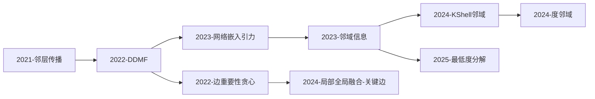

# 论文合集 → 知识图谱 完整方案

## 背景

用户有 37 篇学术论文（PDF），涵盖复杂网络关键节点识别、近视预测、NLP/文本挖掘、生物医学等方向。目标是构建一个可查询、可导航的知识图谱，最终可在 Obsidian 中查看关系网络，或通过其他方式浏览论文间的关联。

---

## 论文清单与分类

> 以下按研究方向分组，标注每篇论文的核心方法关键词，便于后续 Phase 2 提取摘要和 Phase 3 建立关联。

### 一、复杂网络 — 关键节点识别（14 篇）

| # | 文件名（缩写） | 第一作者 | 年份 | 核心方法关键词 |
|---|---|---|---|---|
| 1 | 基于邻层传播的相对重要节点挖掘方法 | — | 2021 | 邻层传播、相对重要节点 |
| 2 | DDMF: Distance Distribution and Multi-Index | Zhao | 2022 | 距离分布、多指标综合 |
| 3 | Edge Importance Greedy Strategy | Li | 2022 | 边重要性贪心策略 |
| 4 | Community Detection and Biased Random Walk | Liu | 2022 | 社区检测、偏置随机游走 |
| 5 | Estimating Relative Importance via Network Embedding and Gravity | Zhao | 2023 | 网络嵌入、引力模型 |
| 6 | Identifying Critical Nodes Based on Neighborhood Information | Zhao | 2023 | 邻域信息、关键节点 |
| 7 | Link Prediction Based on Weighted Local and Global Closeness | Wang | 2023 | 链路预测、加权紧密度 |
| 8 | Identifying Key Spreaders via Local Clustering Coefficient and Structural Holes | Wang | 2023 | 聚类系数、结构洞 |
| 9 | GNNTALA: Novel Model for Identifying Critical Nodes | Wang | 2024 | GNN、关键节点识别 |
| 10 | K-Shell and Neighborhood Information | Zhao | 2024 | K-Shell、邻域信息 |
| 11 | Degree and Neighborhood Information | Zhao | 2024 | 度信息、邻域信息 |
| 12 | Lowest Degree Decomposition | Yu | 2025 | 最低度分解 |
| 13 | Synergistic Integration of Local and Global Information for Critical Edge Identification | Zhao | 2024 | 局部-全局信息融合、关键边识别 |
| 14 | 基于最大连通子图相对效能的相依网络鲁棒性分析 | 赵娜 | — | 相依网络、最大连通子图、鲁棒性 |

### 二、近视预测（4 篇）

| # | 文件名（缩写） | 第一作者 | 年份 | 核心方法关键词 |
|---|---|---|---|---|
| 15 | 基于近视筛查数据的近视影响因素分析和近视预测 | — | 2021 | 筛查数据、影响因素分析 |
| 16 | Myopia Prediction via Time-Aware Deep Learning | Huang | 2023 | 时间感知深度学习、儿童青少年近视 |
| 17 | EGS-Net: Knowledge-Augmented ML for High-Myopia Risk | Tang | 2026 | 知识增强、高近视风险预测 |
| 18 | Myo-ODE: Continuous-Time Trajectory Reconstruction via Neural ODE | Zhao | 2026 | 神经常微分方程、轨迹重建 |

### 三、NLP / 文本挖掘（5 篇）

| # | 文件名（缩写） | 第一作者 | 年份 | 核心方法关键词 |
|---|---|---|---|---|
| 19 | Improved TextRank Based on Complex Network Features | Li | 2026 | TextRank、复杂网络特征 |
| 20 | Doc2Vec-Based Similarity Analysis of Tobacco Standard Texts | Li | 2026 | Doc2Vec、文本相似度 |
| 21 | Legal Dispute Analysis Integrating Prompt Engineering | Zhang | 2025 | 提示工程、法律文本分析 |
| 22 | Dual Channel Semantic Enhancement CNN for Text Classification | Zhang | 2025 | 双通道语义增强、CNN |
| 23 | 基于 DeepSeek-R1 的医疗垂直大语言模型架构方法 | 唐瑞翔 | — | DeepSeek-R1、医疗LLM |

### 四、生物医学（5 篇）

| # | 文件名（缩写） | 第一作者 | 年份 | 核心方法关键词 |
|---|---|---|---|---|
| 24 | Lycopene, Race and Periodontitis Disparities | Kwong | 2026 | 番茄红素、种族差异、牙周炎 |
| 25 | ELISA Protein Detector (EPD) | Lu | 2025 | ELISA、蛋白质定量、Python工具 |
| 26 | Improved Stacked Ensemble with GA for ECG Diagnosis | Zhao | 2024 | 堆叠集成、遗传算法、ECG诊断 |
| 27 | 基于德尔菲法构建结核病科医院感染管理风险评估表 | 赵娜 | — | 德尔菲法、风险评估、结核病 |
| 28 | 寡孢节丛孢 Hog1-MAPK 互作蛋白的功能研究 | 赵娜 | — | MAPK信号通路、蛋白互作 |

### 五、其他方向（9 篇）

| # | 文件名（缩写） | 第一作者 | 年份 | 研究方向 | 核心方法关键词 |
|---|---|---|---|---|---|
| 29 | BiLSTM-KAN: Traffic Flow Forecasting | Chen | 2024 | 时间序列预测 | BiLSTM、KAN、交通流 |
| 30 | Random RotBoost: Rotation Forest + AdaBoost | Lee | 2022 | 集成学习 | Rotation Forest、AdaBoost |
| 31 | Adaptive Fusion of Multi-View Contrastive Recommendation | Liu | 2026 | 推荐系统 | 多视图融合、对比学习 |
| 32 | AttenE: KG Completion via Entity-Relation Attention | Mou | 2026 | 知识图谱 | 注意力嵌入、KG补全 |
| 33 | SARIMA-Based Medium- and Long-Term Load Forecasting | Yin | 2023 | 时间序列预测 | SARIMA、电力负荷预测 |
| 34 | ExInCOACH: Strategic Exploration for Game Onboarding | Hua | 2026 | 游戏AI | 探索策略、交互式教程 |
| 35 | TFSM: Time-Frequency Synergistic Modeling with Mamba | Zhao | 2026 | 信号处理 | Mamba、时频建模 |
| 36 | 公共数据有偿服务的正当性与实践路径研究 | 钟书丽 | — | 法学/公共管理 | 公共数据、有偿服务 |
| 37 | 雾环境下基于度量学习的两阶段入侵检测系统 | 王伟飞 | — | 网络安全 | 度量学习、入侵检测 |

### 论文统计概览

| 研究方向 | 论文数 | 占比 | 主要作者 |
|---|---|---|---|
| 复杂网络 — 关键节点识别 | 14 | 38% | 赵娜（6篇）、Wang、Li、Liu、Yu |
| NLP / 文本挖掘 | 5 | 14% | Li、Zhang、唐瑞翔 |
| 生物医学 | 5 | 14% | 赵娜（2篇）、Kwong、Lu |
| 近视预测 | 4 | 11% | Zhao、Huang、Tang |
| 时间序列/预测 | 2 | 5% | Chen、Yin |
| 其他方向 | 7 | 19% | — |

### 跨领域关联预标注

| 跨领域模式 | 源领域 | 目标领域 | 涉及论文 |
|---|---|---|---|
| 复杂网络方法 → 文本挖掘 | 复杂网络 | NLP | Li-2026-TextRank（用复杂网络特征改进 TextRank） |
| 复杂网络方法 → 生物信息 | 复杂网络 | 生物医学 | 寡孢节丛孢（蛋白互作网络分析） |
| 深度学习 → 近视预测 | AI/深度学习 | 近视预测 | Huang-2023、Tang-2026、Zhao-2026-MyoODE |
| 知识图谱 → 推荐/医疗 | 知识图谱 | 推荐系统/NLP | Mou-2026-AttenE、唐瑞翔-DeepSeek-R1 |
| 集成学习 → 生物医学 | 集成学习 | 生物医学 | Zhao-2024-ECG（堆叠集成+GA用于ECG诊断） |

---

## 知识图谱本体设计

> 定义图谱中的节点类型、边类型和属性规范，确保构建过程的一致性和查询的可用性。

### 节点类型（7 类）

#### 1. Paper（论文节点）
核心节点类型，每篇论文生成一个。

```yaml
id: "paper-2024-zhao-kshell"
type: Paper
title: "A Key Node Mining Method Based on K-Shell and Neighborhood Information"
year: 2024
authors: ["赵娜", "作者2", "作者3"]  # 与 Author 节点关联
category: "complex_network"           # 一级分类
subcategory: "critical_node"          # 二级分类
tags: ["K-Shell", "关键节点", "邻域信息", "复杂网络"]
lang: "en"                            # en | zh
abstract: "论文摘要..."
doi: ""                               # 如有
filename: "Zhao 等 - 2024 - A Key Node Mining Method....pdf"
```

#### 2. Author（作者节点）

```yaml
id: "author-zhao-na"
type: Author
name: "赵娜"
name_en: "Zhao Na"
role: "advisor"                       # advisor(导师) | student(学生) | collaborator(合作者)
papers: ["paper-2022-ddmf", "paper-2023-gravity", ...]  # 关联论文ID列表
affiliation: ""                       # 所属机构
```

#### 3. Method（方法/算法节点）

```yaml
id: "method-k-shell"
type: Method
name: "K-Shell Decomposition"
name_zh: "K-Shell 分解"
category: "graph_algorithm"           # 方法大类
subcategory: "centrality"             # 方法子类
description: "通过迭代剥离度小于 k 的节点来识别网络核心..."
papers_using: ["paper-2024-kshell", "paper-2022-ddmf"]  # 使用该方法的论文
papers_extending: ["paper-2025-lowest-degree"]           # 改进该方法的论文
```

#### 4. Dataset（数据集节点）

```yaml
id: "dataset-myopia-screening"
type: Dataset
name: "某市近视筛查数据集"
domain: "myopia"
size: "xxx 条记录"
source: "某市中小学体检数据"
papers_using: ["paper-2021-myopia", "paper-2023-myopia-dl"]
```

#### 5. Concept（概念/理论节点）

```yaml
id: "concept-structural-hole"
type: Concept
name: "Structural Hole"
name_zh: "结构洞"
domain: "complex_network"            # 所属领域
definition: "社会网络中两个不连通群体之间的桥接位置..."
papers: ["paper-2023-key-spreaders"]
related_concepts: ["concept-betweenness", "concept-bridging"]
```

#### 6. Metric（评估指标节点）

```yaml
id: "metric-kendall-tau"
type: Metric
name: "Kendall τ"
domain: "ranking"
description: "衡量两个排序序列相关性的指标"
papers_using: ["paper-2023-critical-nodes", "paper-2024-kshell"]
```

#### 7. Tool（工具/软件节点）

```yaml
id: "tool-mineru"
type: Tool
name: "MinerU"
purpose: "pdf_conversion"
papers_processed: ["*"]              # 用于处理流程的工具
```

### 边类型（9 类）

| 边类型 | 标签 | 方向 | 含义 | 强度 |
|---|---|---|---|---|
| `proposes` | 提出 | Paper → Method | 论文首次提出某方法 | 强 |
| `uses` | 使用 | Paper → Method/Dataset/Tool/Concept | 论文使用某方法/数据/概念 | 中 |
| `extends` | 改进 | Method → Method | 某方法是对另一方法的改进/扩展 | 强 |
| `compares_with` | 对比 | Paper ↔ Paper | 两篇论文进行了方法对比 | 中 |
| `cites` | 引用 | Paper → Paper | A 引用 B | 强 |
| `co_author` | 合作 | Author ↔ Author | 作者间有合作关系 | 中 |
| `same_category` | 同领域 | Paper ↔ Paper | 同属一个研究方向 | 弱 |
| `applies_to` | 应用于 | Method → Concept/Domain | 方法被应用到某领域 | 中 |
| `outperforms` | 超越 | Method → Method | 在某指标上表现更优 | 中 |

### 方法层级分类体系

为 Method 节点定义统一的三级分类标签，避免同义不同名：

```
图论/网络科学 (graph_theory)
├── 中心性度量 (centrality)
│   ├── 度中心性 (degree_centrality)
│   ├── K-Shell 分解 (kshell)
│   ├── 介数中心性 (betweenness)
│   └── 特征向量中心性 (eigenvector)
├── 社区检测 (community_detection)
├── 链路预测 (link_prediction)
├── 传播模型 (spreading_model)
└── 鲁棒性分析 (robustness)

深度学习 (deep_learning)
├── GNN/图神经网络 (gnn)
├── CNN/卷积网络 (cnn)
├── RNN/LSTM (rnn)
├── Transformer (transformer)
├── Neural ODE (neural_ode)
└── 注意力机制 (attention)

传统机器学习 (ml_classical)
├── 集成学习 (ensemble)
│   ├── AdaBoost (adaboost)
│   ├── Rotation Forest (rotation_forest)
│   └── Stacking (stacking)
├── 随机森林 (random_forest)
├── SVM (svm)
└── 遗传算法 (genetic_algorithm)

NLP (nlp)
├── TextRank (textrank)
├── Doc2Vec (doc2vec)
├── 文本分类 (text_classification)
└── LLM (llm)

统计方法 (statistics)
├── SARIMA (sarima)
├── 德尔菲法 (delphi)
└── 回归分析 (regression)
```

> 实际标注时，每篇论文的 Method 标签从此体系中选取，新方法可扩充。

---

## 关系类型体系

> 论文间关系的细粒度分类，驱动 Phase 3 中 graphify 和手动链接的生成。

### 论文间关系矩阵

| 关系类型 | 强度 | 方向 | 触发条件 | 示例 |
|---|---|---|---|---|
| **方法直接改进** | ★★★ 强 | 有向 | B 论文明确在 A 论文方法基础上改进/扩展 | K-Shell (2012) → WK-Shell (2024) |
| **共享核心方法** | ★★ 中 | 无向 | 多篇论文使用同一基础方法的不同变体 | 3 篇论文都基于 K-Shell 改进 |
| **同作者系列** | ★★★ 强 | 无向 | 同一作者（组）的论文系列，通常有方法演进 | 赵娜 6 篇复杂网络论文 |
| **共享数据集** | ★★ 中 | 无向 | 使用相同数据集进行实验评估 | 近视预测 4 篇共享筛查数据 |
| **竞争方法** | ★★ 中 | 无向 | 解决同一问题但采用不同技术路线 | DDMF vs GNNTALA 均做关键节点识别 |
| **跨领域应用** | ★ 弱 | 有向 | 某领域方法被迁移到另一领域 | 复杂网络方法用于 TextRank 改进 |
| **共享理论框架** | ★ 弱 | 无向 | 基于相同的基础理论/数学工具 | 多篇论文基于信息熵度量节点重要性 |
| **显式引用** | ★★★ 强 | 有向 | 论文中明确引用另一篇 | 从参考文献列表提取 |
| **师生传承** | ★★ 中 | 有向 | 导师-学生合作发表的论文系列 | 赵娜作为通讯作者的多篇论文 |

### 关系强度在 Obsidian 中的表示

| 强度 | Obsidian 链接写法 | CSS class | 用途 |
|---|---|---|---|
| ★★★ 强 | `[[paper-B]]` (直接内链) | `strong-link` | 图谱中高亮显示 |
| ★★ 中 | `[[paper-B]]` + 标签注释 | `mid-link` | 正常显示 |
| ★ 弱 | 在 `## 相关论文` 段落中用列表提及 | `weak-link` | 虚线或灰色 |

### 赵娜导师团队核心论文网络预分析

```
赵娜 (导师, 6篇复杂网络 + 2篇生物医学)
│
├── 复杂网络关键节点系列（方法演进链）:
│   2022-DDMF → 2023-Network-Embedding-Gravity → 2023-Neighborhood-Info
│   → 2024-KShell-Neighborhood → 2024-Degree-Neighborhood → 2024-Critical-Edge
│
├── 生物医学跨领域:
│   2024-ECG-Diagnosis (集成学习→医学诊断)
│   德尔菲法-结核病风险评估 (公共卫生)
│   寡孢节丛孢-Hog1-MAPK (分子生物学)
│
└── 近视预测合作:
    2026-Myo-ODE (与 Tang-2026-EGS-Net 共享研究对象)
```

---

## 总体管线

```
PDF 论文  ──→  Full Markdown  ──→  Abstract Markdown  ──→  Knowledge Graph
 (37篇)      (完整内容提取)        (结构化摘要)            ([[wiki-link]] 互联)
```

---

## Phase 1: PDF → Full Markdown

**工具**: `pdf-converter-mineru`（基于上海 AI Lab MinerU 引擎）

**为什么选它**:
- 中文 PDF 解析能力最强（公式 97.29%、表格 94.48%）
- 支持双栏/多栏排版、扫描件 OCR
- 自动处理公式→LaTeX、表格保留结构
- 一行安装：`npx skills add tanis90/pdf-converter-mineru`

**执行方式**: 批量处理 37 篇论文，输出到 `full_markdown/` 目录

---

## Phase 2: Full Markdown → Abstract Markdown

**工具**: Claude Code 本身（逐篇深度阅读 + 结构化总结）

### 2.1 单篇论文摘要提取 Prompt

> 以下 Prompt 用于逐篇处理，确保 37 篇摘要格式一致。

```
你是一位学术论文分析专家。请仔细阅读以下论文全文（Markdown 格式），
提取关键信息并输出为结构化摘要。

## 输出格式要求

### YAML Frontmatter（必须严格遵循）
```yaml
---
title: "论文完整标题（英文保持原文，中文用简体）"
title_zh: "中文译名（如有）"
authors: ["作者1", "作者2", "通讯作者标注*"]
year: 2024
category: "research_area"          # 从分类体系选择：complex_network | myopia | nlp | biomedicine | recommendation | time_series | knowledge_graph | cybersecurity | legal | other
tags: [标签1, 标签2, 标签3]        # 3-5个关键词，优先使用标准化标签词汇表
lang: "en"                         # en | zh
---
```

### 正文结构（使用以下固定标题）

#### 研究目标
- 1-2 句话概括论文要解决的核心问题

#### 方法
- 核心技术/算法/框架名称
- 方法类型（从标准方法层级中选取：如 kshell, gnn, ensemble 等）
- 关键公式/模型结构简述

#### 创新点
- 与已有工作的主要区别（2-3 点）
- 每条创新点用 "- " 开头

#### 数据集
- 使用的数据集名称
- 数据规模
- 数据来源/领域

#### 评估指标
- 使用了哪些指标（如 Accuracy, Kendall τ, AUC, F1 等）
- 与哪些 baseline 方法进行了对比

#### 关键结论
- 主要发现（2-3 条）
- 局限性（如有提及）

#### 与其他论文的关联
- 引用了哪些关键方法/论文
- 被哪些后续工作引用/改进
- 与本合集中其他论文的可能关联（标注论文编号 #1-#37）
```

### 2.2 标签词汇标准化表

> 所有 tags 字段必须从以下词汇表选择或复合，确保跨论文可链接。

| 标签类别 | 标准化标签 | 说明 |
|---|---|---|
| 网络结构 | `复杂网络`, `相依网络`, `无标度网络`, `小世界网络` | |
| 节点重要性 | `关键节点`, `节点重要性`, `传播影响力`, `结构洞` | |
| 中心性方法 | `K-Shell`, `度中心性`, `介数中心性`, `紧密度`, `特征向量中心性`, `PageRank` | |
| 图算法 | `社区检测`, `链路预测`, `随机游走`, `网络嵌入`, `图神经网络` | |
| 深度学习 | `CNN`, `RNN`, `LSTM`, `Transformer`, `注意力机制`, `Neural ODE`, `Mamba` | |
| 传统ML | `集成学习`, `AdaBoost`, `随机森林`, `SVM`, `遗传算法`, `XGBoost` | |
| NLP | `TextRank`, `Doc2Vec`, `文本分类`, `文本相似度`, `提示工程`, `LLM`, `知识图谱` | |
| 近视领域 | `近视预测`, `高近视`, `屈光度`, `眼轴长度`, `儿童青少年` | |
| 生物医学 | `ECG诊断`, `ELISA`, `蛋白互作`, `风险评估`, `德尔菲法` | |
| 时序预测 | `SARIMA`, `时间序列`, `交通流预测`, `负荷预测` | |

### 2.3 同组论文关联发现 Prompt

> 将同一研究方向的论文放在同一上下文窗口处理时，追加以下指令：

```
## 额外任务：组内关联发现

你已经阅读了本组全部论文的摘要。请额外输出一个"组内关联分析"章节：

### 方法演进链
- 按时间顺序列出本组方法的演进关系
- 标注哪些论文是对前序工作的直接改进

### 共享元素
- 共享的数据集
- 共享的理论框架
- 共享的 baseline 方法

### 方法对比矩阵
| 论文简称 | 核心方法 | 创新维度 | 最优指标 | 局限性 |
|---|---|---|---|---|
| ... | ... | ... | ... | ... |
```

### 2.4 跨领域关联发现 Prompt

> 全量摘要完成后，追加一次跨领域扫描：

```
## 任务：跨领域关联发现

以下是全部 37 篇论文的 YAML 摘要。请识别：

1. **跨领域方法迁移**：某领域的方法被应用到另一领域
   - 例：复杂网络的 K-Shell 方法被用于文本关键词提取（Li-2026-TextRank）
   - 例：深度学习（Neural ODE）被用于近视轨迹建模（Zhao-2026-MyoODE）

2. **共享方法论**：不同领域的论文使用了相同的底层数学/算法工具

3. **潜在合作桥接**：两个领域的研究可通过某篇跨领域论文建立关联

输出格式：
| 关联ID | 源论文 | 目标论文 | 关联类型 | 关联说明 |
|---|---|---|---|---|
| CROSS-01 | #23 KShell-2024 | #19 TextRank-2026 | 方法迁移 | K-Shell 思想迁移到文本图排序 |
```

**执行方式**:
1. 按主题分组处理（复杂网络组、近视预测组、NLP组、生物医学组、其他）
2. 同组论文放在同一上下文窗口，便于发现关联
3. 每组输出到 `abstracts/<组名>/` 目录
4. 全部完成后运行一次跨领域关联扫描

---

## Phase 3: Abstract Markdown → Knowledge Graph

**方式一（主推）: graphifyy + Obsidian**
```bash
uv tool install "graphifyy[pdf,chinese]"
graphify extract ./abstracts --obsidian --obsidian-dir ./knowledge-base
```
- 自动生成 `[[wiki-link]]` 双向链接
- 生成 `graph.html` 可视化图谱
- 生成 `GRAPH_REPORT.md` 标注核心节点和意外关联
- 用 Obsidian 打开 `knowledge-base/` 作为 vault 即可看到关系图谱

**`.graphifyignore` 配置**（避免无关文件进入图谱）:
```
# .graphifyignore
full_markdown/
README.md
*.caj
```

**方式二（备选）: 手动构建**
- Claude Code 分析全部 abstract 后，自动为每篇论文写入 `## 相关论文` 章节
- 根据：共享关键词、共享方法、引用关系、主题聚类
- 生成 MOC（Map of Content）索引文件，按研究方向组织

**方式三（混合，推荐）: graphifyy 做骨架 + 手动补充深度链接**
- graphifyy 快速生成概念级图谱
- 手工为关键论文补充精细化 `[[link]]`，特别是：
  - 方法演进链（DDMF → 后续改进）
  - 同作者系列论文间的显式链接
  - 跨领域方法迁移链接

---

## MOC 与导航结构设计

### Obsidian Vault 目录结构

```
论文合集/
├── full_markdown/                    # Phase 1 输出：完整 MD（37 个文件）
├── abstracts/                        # Phase 2 输出：结构化摘要
│   ├── 00-复杂网络-关键节点/         # 14 篇
│   ├── 01-近视预测/                  # 4 篇
│   ├── 02-NLP文本挖掘/               # 5 篇
│   ├── 03-生物医学/                  # 5 篇
│   ├── 04-推荐系统/                  # 1 篇
│   ├── 05-时间序列预测/              # 2 篇
│   ├── 06-知识图谱/                  # 1 篇
│   └── 07-其他/                      # 5 篇
├── knowledge-base/                   # Phase 3 输出：Obsidian vault
│   ├── _MOC.md                       # 总索引（四维导航）
│   ├── _STATS.md                     # 统计面板
│   ├── _CROSS_DOMAIN.md              # 跨领域关联图谱
│   ├── _METHOD_INDEX.md              # 按方法索引
│   ├── 00-复杂网络-关键节点/
│   │   ├── _INDEX.md                 # 该方向索引 + 方法演进图
│   │   ├── 论文文件...（graphify 自动生成）
│   │   └── ...
│   ├── 01-近视预测/
│   │   ├── _INDEX.md
│   │   └── ...
│   ├── ...（其余分类同上）
│   └── _AUTHORS/                     # 按作者索引
│       ├── 赵娜.md
│       ├── Zhao-Na.md
│       └── ...
├── graph.html                        # 可视化知识图谱
└── GRAPH_REPORT.md                   # 图谱分析报告
```

### _MOC.md 模板

```markdown
# 论文知识图谱 — 总索引 (Map of Content)

## 按研究方向导航

- [[00-复杂网络-关键节点/_INDEX|复杂网络 — 关键节点识别]]（14 篇）
- [[01-近视预测/_INDEX|近视预测]]（4 篇）
- [[02-NLP文本挖掘/_INDEX|NLP / 文本挖掘]]（5 篇）
- [[03-生物医学/_INDEX|生物医学]]（5 篇）
- [[04-推荐系统/_INDEX|推荐系统]]（1 篇）
- [[05-时间序列预测/_INDEX|时间序列预测]]（2 篇）
- [[06-知识图谱/_INDEX|知识图谱]]（1 篇）
- [[07-其他/_INDEX|其他方向]]（5 篇）

## 按方法导航

→ [[_METHOD_INDEX|方法索引]]

## 按作者导航

→ [[_AUTHORS/赵娜|赵娜]]（导师，8 篇）
→ 更多作者...

## 跨领域关联

→ [[_CROSS_DOMAIN|跨领域关联图谱]]

## 统计概览

→ [[_STATS|统计面板]]
```

### _INDEX.md 模板（以复杂网络组为例）

```markdown
# 复杂网络 — 关键节点识别 索引

> 共 14 篇论文，时间跨度 2021–2025

## 方法演进图



## 论文列表

| 年份 | 标题 | 核心方法 | 关键贡献 |
|---|---|---|---|
| 2021 | [[邻层传播]] | 邻层传播 | ... |
| 2022 | [[DDMF]] | 距离分布+多指标 | ... |
| ... | ... | ... | ... |

## 核心方法在本组的使用分布

- K-Shell 系列: 4 篇
- 邻域信息: 3 篇
- 网络嵌入: 2 篇
- 随机游走: 2 篇

## 与其他方向的关联

- → [[02-NLP文本挖掘/_INDEX|NLP]]: TextRank 借鉴了复杂网络中心性思想
- → [[03-生物医学/_INDEX|生物医学]]: 蛋白互作网络分析
```

---

## 实体抽取规范

> Phase 2 执行时的具体抽取规则，确保人工和自动抽取的一致性。

### 方法名抽取规则

| 识别模式 | 示例 | 标准化输出 |
|---|---|---|
| 缩写 + 全称 | "DDMF (Distance Distribution and Multi-Index)" | `DDMF` |
| 算法关键词 + 名称 | "提出了基于XXX的YYY算法" | `YYY` |
| 知名方法引用 | "基于 K-Shell 分解" | `K-Shell` |
| 自定义模型名 | "GNNTALA model" | `GNNTALA` |
| 中文方法描述 | "基于邻层传播的相对重要节点挖掘方法" | `邻层传播方法` (提取简称) |

### 数据集识别规则

| 识别模式 | 示例 |
|---|---|
| 专有名词大写缩写 | "CIFAR-10", "ImageNet" |
| 领域 + 数据描述 | "某市 2018-2022 年中小学体检数据" |
| 公开数据库名称 | "MIMIC-III", "PhysioNet" |
| 自定义采集数据 | 标注 `[自采]` |

### 评估指标标准化

| 原始文本 | 标准化 | 适用场景 |
|---|---|---|
| "准确率", "Accuracy", "ACC" | `Accuracy` | 分类 |
| "AUC", "ROC 下面积" | `AUC` | 分类/排序 |
| "Kendall τ", "肯德尔系数" | `Kendall τ` | 排序相关性 |
| "F1", "F1-score" | `F1` | 分类 |
| "传播阈值", "epidemic threshold" | `Epidemic Threshold` | 传播模型 |
| "MSE", "RMSE", "MAE" | `MSE` / `RMSE` / `MAE` | 回归 |
| "SIR 模型感染率" | `SIR Infection Rate` | 传播动力学 |

### 作者消歧规则

| 情况 | 处理方式 |
|---|---|
| 同一作者中英文名 | 建立映射: `赵娜 ↔ Zhao Na`，统一索引到 `赵娜` |
| 同名不同人 | 结合 affiliation 区分，标注 `赵娜(A)` `赵娜(B)` |
| 导师/学生关系 | 从论文通讯作者标注和致谢中推断，标注在 Author 节点 |
| 作者顺序 | 保留原始顺序，通讯作者在 frontmatter 中用 `*` 标注 |

### 理论基础标注

从论文中识别引用的基础理论，标注为 Concept 节点：

| 理论领域 | 识别关键词 |
|---|---|
| 图论 | 度分布、邻接矩阵、连通性、最短路径、最小生成树 |
| 信息论 | 信息熵、互信息、KL散度、香农熵 |
| 统计学习 | VC维、偏差-方差、正则化、贝叶斯推断 |
| 传播动力学 | SIR、SIS、SIRS、基本再生数 |
| 博弈论 | 纳什均衡、演化博弈 |
| 优化理论 | 凸优化、梯度下降、拉格朗日乘子 |

---

## 各阶段质量检查清单

### Phase 1 检查（PDF → Full Markdown）

| 检查项 | 标准 | 抽样方式 |
|---|---|---|
| 公式转换 | LaTeX 渲染正确，公式编号保留 | 抽查 5 篇，每篇随机检查 3 个公式 |
| 表格保留 | 表格行列结构完整，合并单元格正确 | 抽查 5 篇 |
| 段落完整性 | 无段落截断、无多余空行 | 全文对比 PDF 页数×段落密度 |
| 双栏处理 | 双栏论文的阅读顺序正确（非混栏） | 检查所有双栏排版的论文 |
| 中文编码 | 中文字符无乱码、无方框 | 检查全部中文论文 |
| 图表提取 | 图片文件完整导出，有对应文件名引用 | 抽查 3 篇含图较多的论文 |
| 参考文献 | 参考文献列表完整，编号保留 | 抽查 3 篇 |

### Phase 2 检查（Full Markdown → Abstract Markdown）

| 检查项 | 标准 | 操作 |
|---|---|---|
| YAML 一致性 | 37 篇的 category 字段值在分类体系中 | `grep "category:" abstracts/**/*.md \| sort \| uniq -c` |
| 标签标准化 | tags 中的词汇在标准化词汇表中 > 90% | 汇总所有 tags，对比词汇表 |
| 信息覆盖度 | 每篇摘要的 7 个章节均有内容（非空） | 逐篇检查 |
| 方法名一致性 | 同一方法在多篇论文中名称统一 | 交叉比对同组论文的方法字段 |
| 关联标注率 | 同组论文间至少标注了 1 条关联 | 检查各组的关联分析章节 |
| 作者名规范 | 中英文名格式一致，通讯作者标注 `*` | 逐篇检查 frontmatter |

### Phase 3 检查（Abstract → Knowledge Graph）

| 检查项 | 标准 | 操作 |
|---|---|---|
| Wiki-link 可达性 | 从 _MOC 出发可到达所有论文节点 | Obsidian 图谱视图中验证 |
| 图谱连通性 | 不存在完全孤立的论文节点 | 检查 Graph View |
| 方法演进链完整 | 同作者系列论文形成连通子图 | 检查赵娜 6 篇复杂网络论文的链接 |
| 跨领域链接 | _CROSS_DOMAIN.md 中每条关联都有对应的 wiki-link | 逐一验证 |
| MOC 导航完整 | 四维导航入口均可点击到达目标 | 手动点击测试 |
| Graph.html 可打开 | 浏览器中正常渲染，节点可点击 | 双击打开验证 |

---

## 输出物

```
论文合集/
├── full_markdown/          # Phase 1: 完整 MD（37 个文件）
├── abstracts/              # Phase 2: 结构化摘要（37 个文件，含 YAML frontmatter）
│   ├── 00-复杂网络-关键节点/
│   ├── 01-近视预测/
│   ├── 02-NLP文本挖掘/
│   ├── 03-生物医学/
│   ├── 04-推荐系统/
│   ├── 05-时间序列预测/
│   ├── 06-知识图谱/
│   └── 07-其他/
├── knowledge-base/         # Phase 3: Obsidian vault
│   ├── _MOC.md             # 总索引
│   ├── _STATS.md           # 统计面板
│   ├── _CROSS_DOMAIN.md    # 跨领域关联
│   ├── _METHOD_INDEX.md    # 方法索引
│   ├── 00-复杂网络-关键节点/
│   │   ├── _INDEX.md
│   │   └── ...
│   ├── 01-近视预测/
│   │   ├── _INDEX.md
│   │   └── ...
│   ├── ... (其余分类)
│   └── _AUTHORS/
│       └── ...
├── graph.html              # 可视化知识图谱
└── GRAPH_REPORT.md         # 图谱分析报告
```

---

## 执行策略

1. **先跑通 1-2 篇**验证 pipeline 质量（特别是中文 PDF 提取和总结模板）
2. **按主题分组并行处理**：同主题论文一起处理（便于发现关联）
3. **每完成一组就建立组内链接**：复杂网络组的 14 篇内部链接最密集
4. **处理赵娜导师论文系列**：6 篇复杂网络 + 2 篇生物医学需要特别关注方法演进链和跨领域关联
5. **最后跨组链接**：运行跨领域关联发现 Prompt，识别方法迁移和共享理论

---

## 风险与应对

| 风险 | 应对 |
|---|---|
| MinerU 对某些 PDF 解析失败 | 回退到 Claude Code 原生 Read 工具逐页读取 |
| 论文全文过长超出上下文窗口 | 分页读取后合并，或先用 Read 预览再定向提取关键章节 |
| graphifyy 生成的链接粒度不够 | 手动补充方法演进链、同作者链接、跨领域链接 |
| 中文论文的实体抽取不准 | 中文论文单独处理，使用中文 Prompt 模板，人工抽查 |
| 同名作者消歧失败 | 结合论文主题和合作者网络人工判别 |
| 标签词汇不一致 | Phase 2 完成后全局 `grep` 检查，批量修正 |

---

## 验证

1. Phase 1 完成后，抽查 3 篇 full MD 的公式、表格、段落完整性
2. Phase 2 完成后，检查摘要模板的一致性和关键信息覆盖度（用 checklist）
3. Phase 3 完成后，在 Obsidian 中打开验证图谱可视化效果和链接可达性
4. 最终验证：能否从 _MOC 出发，在 3 次点击内到达任意一篇论文
